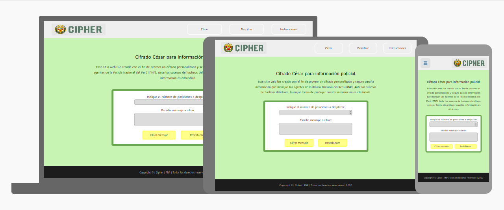
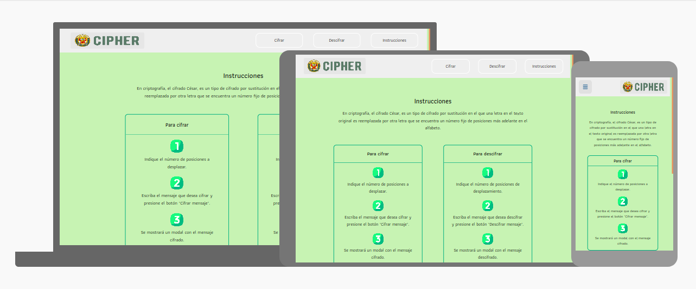
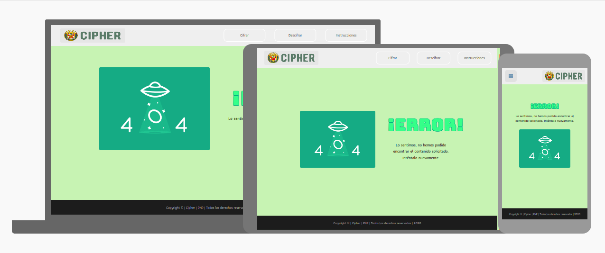

<p align="center"><a href="public/logo.png"></a></p>
<h1 align="center">CIPHER</h1>
<p align="center">


</p>


Este sitio web fue creado con el fin de proveer un cifrado personalizado y seguro para la información que manejan los agentes de la Policía Nacional del Perú (PNP). Ante los sucesos de hackeos delictivos, la mejor forma de proteger nuestra información es cifrándola.


## Preámbulo

Cifrar significa codificar. El [cifrado César](https://en.wikipedia.org/wiki/Caesar_cipher)
es uno de los primeros métodos de cifrado conocidos. El emperador romano Julio
César lo usaba para enviar órdenes secretas a sus generales en los campos de
batalla.


El cifrado césar es una de las técnicas más simples para cifrar un mensaje. Es
un tipo de cifrado por sustitución, es decir que cada letra del texto original
es reemplazada por otra que se encuentra un número fijo de posiciones
(desplazamiento) más adelante en el mismo alfabeto.

Por ejemplo, si usamos un desplazamiento (_offset_) de 3 posiciones:

* La letra A se cifra como D.
* La palabra CASA se cifra como FDVD.
* Alfabeto sin cifrar: A B C D E F G H I J K L M N O P Q R S T U V W X Y Z
* Alfabeto cifrado: D E F G H I J K L M N O P Q R S T U V W X Y Z A B C

En la actualidad, todos los cifrados de sustitución simple se descifran con
mucha facilidad y, aunque en la práctica no ofrecen mucha seguridad en la
comunicación por sí mismos; el cifrado César sí puede formar parte de sistemas
más complejos de codificación, como el cifrado Vigenère, e incluso tiene
aplicación en el sistema ROT13.

## Acerca de la aplicación

- Analiza el alfabeto simple (sin ñ).
- Implementado para mayúsculas y minúsculas.
    - **Mayúsculas:**  A B C D E F G H I J K L M N O P Q R S T U V W X Y Z
    - **Minúsculas:**   a b c d e f g h i j k l m n o p q r s t u v w x y z
- Tiene soporte para el ingreso de carácteres inválidos.
- Los usuarios son los agentes de la Policía Nacional del Perú (PNP).


## Instrucciones de la aplicación

#### Para cifrar:
- Indique el número de posiciones a desplazar (_offset_).
- Escriba el mensaje que desea cifrar y presione el botón `"Cifrar mensaje"`. 
- Se mostrará un modal con el mensaje cifrado. 

#### Para descifrar:
- Indique el número de posiciones de desplazamiento (_offset_). 
- Escriba el mensaje que desea descifrar y presione el botón `"Descifrar mensaje"`. 
- Se mostrará un modal con el mensaje descifrado. 


## Investigación UX:
  
#### ¿Quiénes son los usuarios y cuáles son los objetivos en relación con el producto?

Los usuarios son los agentes de la Policía Nacional del Perú y tiene por objetivo ser una herramienta de cifrado y descifrado para la información ingresada.

#### ¿Cómo el producto soluciona los problemas/necesidades de dichos usuarios?

Es una herramienta simple, de fácil uso y anónima. Estás tres características protegen información sensible y personal ingresada por los usuarios; así también, simplifican tiempo de uso.

#### Prototipo de baja fidelidad


## Demos

- **View encode**



- **View decode**


- **View instructions**



- **View page error**



## Sobre el proyecto

- Implementado en `VanillaJs`.
- Otras tecnologías: `Jest`,`Sass`, `Css` y `Html`.
- Pruebas unitarias con coverage al 100%.
- Desplegado en `gh-pages`.

## Boilerplate del proyecto
El _boilerplate_ contiene la siguiente estructura de archivos:

```text
.
├── src
|  ├── assets
|  ├── controller
|  ├── js
|  |    └── cipher.js
|  ├── style
|  |    ├── css
|  |    └── sass
|  |       ├── abstracts
|  |       ├── base
|  |       ├── components
|  |       ├── layout
|  |       ├── pages
|  |       └── style.scss
|  ├── utils
|  ├── view
|  └── index.html
├── test
├── .eslintrc.js
├── .gitignore
├── .stylelintrc.json
├── manifest.json
├── package.json
└── README.md

directories: 15 
```    

## Recursos 

- [Fórmula Caesar Cipher](https://img.youtube.com/vi/zd8eVrXhs7Y/0.jpg)
- [Fórmula tarjeta de crédito válida](https://www.youtube.com/watch?v=f0zL6Ot9y_w)
- [Aprende más sobre `ASCII`](http://conceptodefinicion.de/ascii/)
- [Vanilla vs JQuery](https://medium.com/laboratoria-how-to/vanillajs-vs-jquery-31e623bbd46e)
- [Metodologías Ágiles](https://www.youtube.com/watch?v=v3fLx7VHxGM)
- [Scrum en menos de 2 minutos](https://www.youtube.com/watch?v=TRcReyRYIMg)
- [Scrum en Detalle](https://www.youtube.com/watch?v=nOlwF3HRrAY&t=297s)
  
  
 ## Licencia

Copyright © 2020, todos los derechos reservados.
